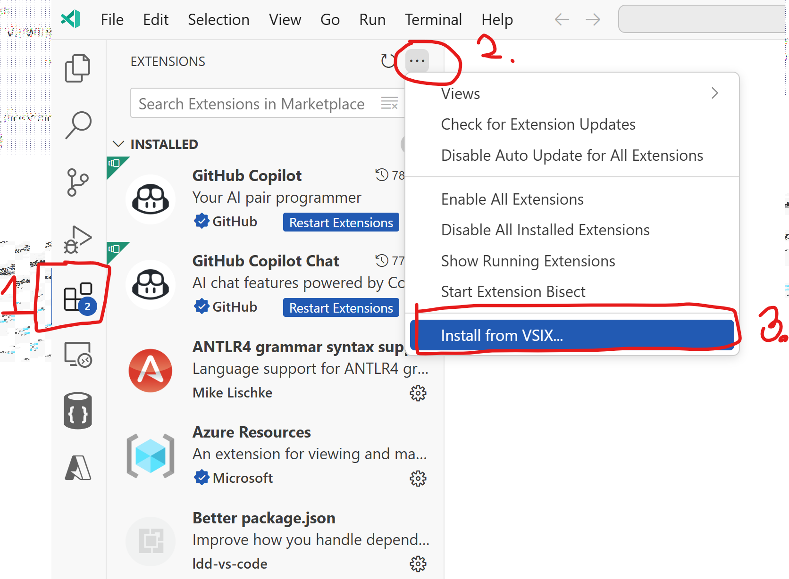
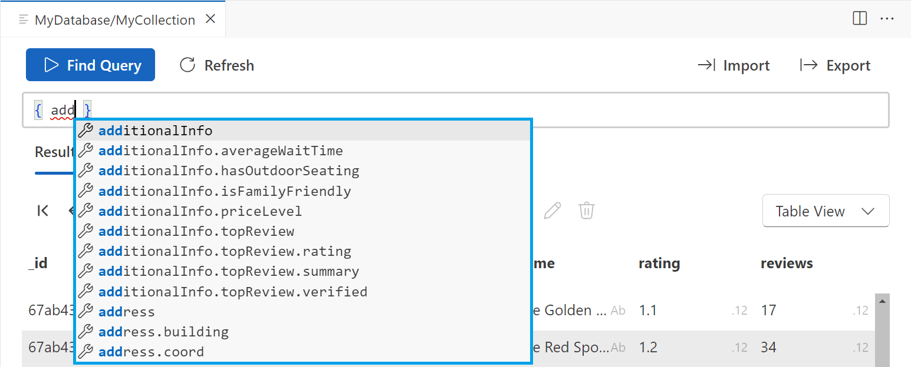
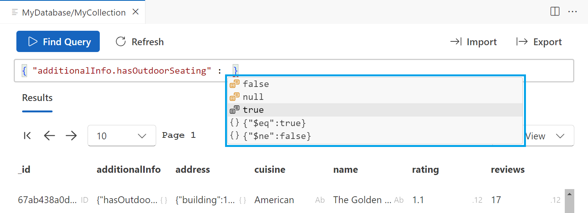

# DocumentDB for VS Code Bug Bash

For the purposes of this bug bash, we will focus on testing the following key features of the VS Code Extension:

- Our new connection management and Service Discovery
- Query Editor
- CRUD Documents
- View documents table/treeview/json
- Download data from query
- Upload query

Please report any bugs found during testing [here](https://microsoft.sharepoint.com/:fl:/r/teams/CosmosDB/Shared%20Documents/Developer%20Experience%20Team/Loop%20paragraph%201.loop?d=w2ded8323914647c59e33d8f7c2137d0f&csf=1&web=1&nav=cz0lMkZ0ZWFtcyUyRkNvc21vc0RCJmQ9YiFPQjdRaHpYV1pVaTYtQ3VhWGtULUI2VFZ1TkYzOHlSSmdSMkhIWDVKMVpYUWpZWWE5ZE9BVEpQU2RWWkZVRWV3JmY9MDFUU043VDRSRFFQV1MyUlVSWVZEWjRNNlk2N0JCRzdJUCZjPSUyRiZmbHVpZD0xJmE9VGVhbXMmcD0lNDBmbHVpZHglMkZsb29wLXBhZ2UtY29udGFpbmVy).

--- 

## Prerequisite
To begin, if you do not already have a sample Cosmos DB for MongoDB (vCore) account or a provisioned DocumentDB instance, create one using the [Azure portal](aka.ms/tryvcore)

> 🛟 We have two backup instances for you to play with, but the more scenarios we test, the better. So we'd encourage you to use your resources.

---

## Setup Instructions

### 1. **Install the DocumentDB for VS Code Extension**

To manually install the Visual Studio Code (VS Code) extension from a VSIX file, you can do the following: Download the latest VS Code Extension Release: [vscode-documentdb-0.1.9-pre-release.vsix](https://github.com/khelanmodi/mongo-vs-code-bug-bash/blob/main/vscode-documentdb-0.1.9-pre-release.vsix)



- Click the Extensions icon at the bottom of the Activity Bar
- Click the More button in the top right corner of the Extensions view
- Select Install from VSIX
- Select the VSIX file in the file browser or in your downloads folder.
- Click Install
- Click Reload to activate the extension

### 2. **Read the Walkthrough**

- **Scenario**: You’ve just installed the DocumentDB extension for VS Code.
- **Action**:
  1. If the walkthrough doesn't appear automatically after install, this might be a bug, please let us know.
  2. Manually activate the walkthrough by opening the **Command Palette** (`Ctrl+Shift+P`), searching for `Welcome: Open Walkthrough...`, and selecting it. Next, look for the `DocumentDB` entry in the list and choose it.
- **Expected Result**: The walkthrough appears, helping you understand the first steps with the extension.


---

## Testing Scenarios

> ⚠️ **Note:** These steps are **not 100% specific** by design, we want you to engage with the actual interface and decide based on what the UI is telling you. This helps us understand whether the on-screen instructions are intuitive and complete.  
>
> We've tested the "common paths" and ensured the basic flow works. That said, there are likely many *non-standard behaviors* and edge cases left unexplored. So don't be afraid to go off-script,  try something unexpected, and help us uncover those hidden quirks.

### 1. **Connection Management – Choose Your Path**

> 🪧 Choose between the options **A**, **B**, or **C**

#### **Option A. Use a Connection String**
- **Scenario**: You have a MongoDB connection string.
- **Action**:
  1. In the **DocumentDB Connections** view, choose **"New Connection"**.
  2. Work with the wizard.
- **Next Step**: You can now choose to:
  - Work from **DocumentDB Connections**, or
  - Use the **Service Discovery** view  
    > 💡 Flip a coin to decide.

#### **Option B. Use Azure Service Discovery (for a vCore Resource)**
- **Scenario**: You have an Azure Cosmos DB for MongoDB (vCore) resource.
- **Action**:
  1. Go to **Service Discovery**.
  2. Activate **"Azure Cosmos DB for MongoDB (vCore)"**.
  3. Navigate to your **Subscription**, then to your **Resource**.
- **Bonus Task**: Attempt to **save this connection** to your **DocumentDB Connections** area.
- **Next Step**: You can now choose to:
  - Work from **DocumentDB Connections**, or
  - Use the **Service Discovery** view  
    > 💡 Flip a coin to decide.

#### **Option C. Use a Provided Demo Resource**
- **Scenario**: You don’t have your own database. No worries!
- **Action**:
  1. 💡 Flip a coin and choose one:
     - **Option 1**: Azure Cosmos DB for MongoDB (vCore)  
       → Go to subscription `CosmosDB-Interop-Mongo`, then select cluster `a-bug-bash-vcore` (credentials provided in chat).
     - **Option 2**: Azure VM  
       → Go to subscription `CosmosDB-Interop-Mongo`, then select `bitnami-mongo-vm` (credentials provided in chat).
- **Bonus Task**: Attempt to **save this connection** to your **DocumentDB Connections** area.
- **Next Step**: You can now choose to:
  - Work from **DocumentDB Connections**, or
  - Use the **Service Discovery** view  
    > 💡 Flip a coin to decide.

### 2. **Try Renaming Your Connection**
- **Scenario**: Rename the connection you've saved.
- **Action**:
  1. Right-click your saved connection and choose **Rename**.
  2. Try naming it something strange (include emojis, slashes, cancel midway, etc.).
- **Expected Result**: Either success or errors, in either case, you're helping us test edge cases. 🧪

### 3. **Add a Broken Connection**
- **Scenario**: What happens when things go wrong?
- **Action**:
  1. Add a new connection with this connection string:  
     `mongodb://auser@notarealserver.com`
  2. Try to connect,  it should fail.
  3. Attempt to edit the credentials. Try invalid values. Cancel and retry.
  4. Try deleting this connection.
- **Expected Result**: Errors should be handled gracefully.

### 4. **Explore the Database Interface**

- **Scenario**: Use the extension to interact with your DocumentDB resource.
- **Action**:
  1. Navigate to one of your connected servers.
  2. Create a **new database and collection**,  use your **initials** in the name (e.g., `AB_DemoDB`, `AB_Collection`).
  3. Open the collection view and explore the views,  **Table**, **Tree**, and **JSON**.
- **Expected Result**: You should be able see an empty collection.

### 5. **Import Sample Data**

- **Scenario**: Populate your collection with sample data.
- **Action**:
  1. Find the option to import sample data (explore the context menu or the collection viewer)
  2. Choose a JSON file containing the sample data: [restaurants-small.json](restaurants-small.json)
  3. Confirm the import operation.
- **Expected Result**: The data is imported successfully, and documents appear in your collection.

### 6. **Search and Query Data**

- **Scenario**: Execute queries to retrieve specific data.
- **Action**:
  1. Right-click on your collection and select **Find Query**.
  2. Enter a query filter, such as `{ "cuisine": "Seafood" }`.
  3. Run the query and observe the results.
- **Expected Result**: The query executes successfully, and matching documents are displayed.

### 6.1 **Use Auto-Completion for Complex Queries**

- **Scenario**: Leverage auto-completion to build a more complex query.
- **Action**:
  1. Start typing `{ add` in the query editor and wait for suggestions to appear.
    
  2. From the suggestions, select `additionalInfo.hasOutdoorSeating`.
  3. Type `:` and choose the value `true`.
    
- **Expected Result**: The query builder should assist with field suggestions and valid values. The resulting query should be something like:  
  ```javascript
  { "additionalInfo.hasOutdoorSeating": true }
  ```

### 7. **Insert a New Document**

- **Scenario**: Add a new document to your collection.
- **Action**:
  1. In your collection, click **Insert Document**.
  2. Paste in a JSON object (you can copy an existing document as a template using **View Document**).
  3. Try different formats,  valid and invalid.
- **Expected Result**: The document should insert correctly. If not, what does the error look like?


### 8. **Export Query Results with `"cuisine": "Seafood"`**
   - **Scenario**: Export all documents where `"cuisine": "Seafood"`.
   - **Action**: Use the following command to filter the results:
     ```javascript
     { "cuisine": "Seafood" }
     ```
   - **Task**: Export the results to a JSON file and count the number of documents in the file.
   - **Expected Result**: A new file containing all documents with `"cuisine": "Seafood"`, along with a document count summary.
